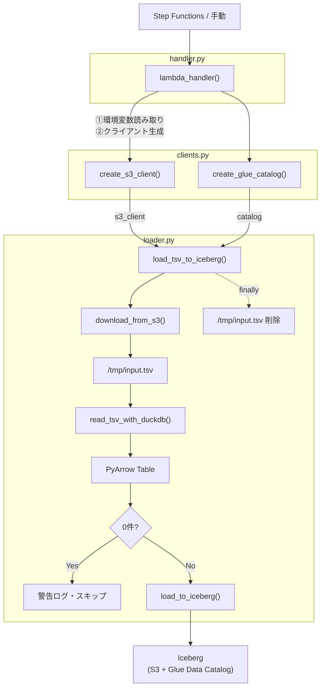
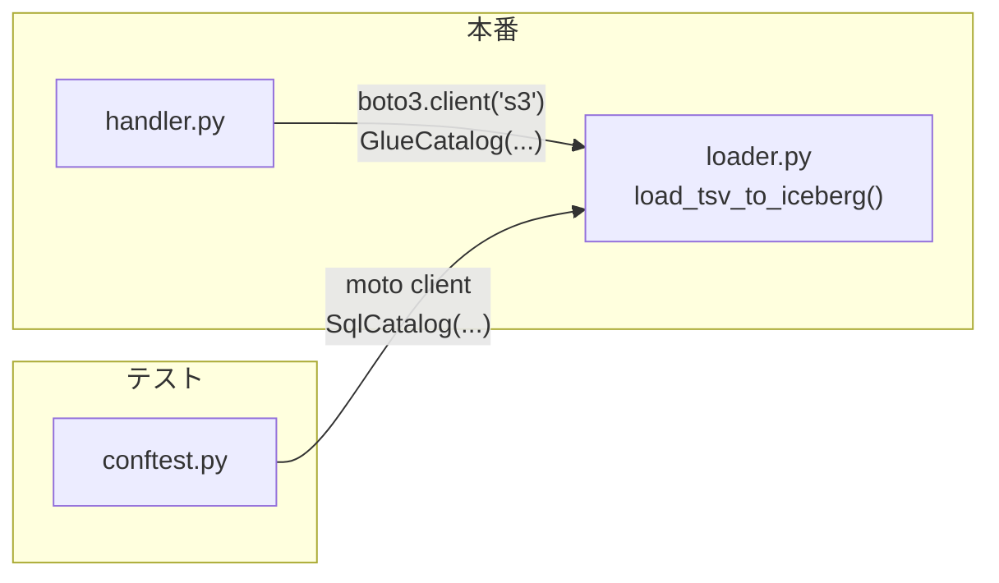

# ソースコード解説

このドキュメントでは `lambda/tsv_to_iceberg_load/src/` のソースコードの構造と各ファイルの役割を説明する。

> **VS Code でのMermaid表示**：図を表示するには拡張機能 [Markdown Preview Mermaid Support](https://marketplace.visualstudio.com/items?itemName=bierner.markdown-mermaid) が必要。

---

## 目次

1. [全体構成と責務の分担](#1-全体構成と責務の分担)
2. [clients.py — AWSクライアント生成](#2-clientspy--awsクライアント生成)
3. [handler.py — Lambdaエントリーポイント](#3-handlerpy--lambdaエントリーポイント)
4. [loader.py — ビジネスロジック](#4-loaderpy--ビジネスロジック)
5. [データフロー全体像](#5-データフロー全体像)
6. [依存性注入（DI）の設計意図](#6-依存性注入diの設計意図)

---

## 1. 全体構成と責務の分担

```
src/
├── clients.py   # AWSクライアントの生成のみ担当（本番用）
├── handler.py   # Lambdaの起動受け口。環境変数読み取りとDI注入を担当
└── loader.py    # S3取得 → DuckDB変換 → Iceberg書き込みのビジネスロジック
```

各ファイルは単一の責務を持ち、依存性注入（DI）によって結合している。

| ファイル | 責務 | AWS依存 |
|---------|------|---------|
| `clients.py` | 本番用AWSクライアントの生成 | あり（boto3 / GlueCatalog） |
| `handler.py` | 起動受け口・環境変数読み取り・DI注入 | あり（clients.py経由） |
| `loader.py`  | データ処理のロジック | なし（引数で受け取るため） |

`loader.py` がAWS依存を持たないことで、テスト時にモックへの差し替えが容易になる。

---

## 2. clients.py — AWSクライアント生成

```python
import boto3
from pyiceberg.catalog.glue import GlueCatalog


def create_s3_client():
    return boto3.client("s3")


def create_glue_catalog(name: str, region: str) -> GlueCatalog:
    return GlueCatalog(name, **{"region_name": region})
```

### 役割

本番環境で使用するAWSクライアントを生成するファクトリ関数のみを定義する。
`handler.py` から呼ばれ、生成したクライアントを `loader.py` に渡す（DI）。

### create_s3_client

- `boto3.client("s3")` で S3 クライアントを生成する
- 認証情報は Lambda 実行ロールの IAM から自動取得される

### create_glue_catalog

- PyIceberg の `GlueCatalog` インスタンスを生成する
- `name` はカタログ名（Glue データベース名を渡す）
- `region_name` で Glue Data Catalog のリージョンを指定する

---

## 3. handler.py — Lambdaエントリーポイント

```python
import logging
import os

from src.clients import create_glue_catalog, create_s3_client
from src.loader import load_tsv_to_iceberg

logger = logging.getLogger(__name__)


def lambda_handler(event: dict, context) -> dict:
    region   = os.environ["GLUE_REGION"]
    database = os.environ["GLUE_DATABASE"]
    table    = os.environ["GLUE_TABLE"]

    bucket: str = event["s3_bucket"]
    key: str    = event["s3_key"]

    s3_client = create_s3_client()
    catalog   = create_glue_catalog(name=database, region=region)

    load_tsv_to_iceberg(
        s3_client=s3_client,
        catalog=catalog,
        namespace=database,
        table_name=table,
        bucket=bucket,
        key=key,
    )

    return {"statusCode": 200, "body": "OK"}
```

### 役割

Lambda が起動されたときに最初に呼ばれる関数（エントリーポイント）。
**環境変数の読み取り・クライアントの生成・ビジネスロジックへの注入** の3つだけを担う。

### 処理の流れ

| ステップ | 内容 |
|---------|------|
| 1 | 環境変数（`GLUE_REGION` / `GLUE_DATABASE` / `GLUE_TABLE`）を読み取る |
| 2 | イベントから S3 バケット名・キーを取得する |
| 3 | `create_s3_client()` で S3 クライアントを生成する |
| 4 | `create_glue_catalog()` で Glue カタログを生成する |
| 5 | `load_tsv_to_iceberg()` にクライアントを注入して呼び出す |
| 6 | 正常終了時に `{"statusCode": 200}` を返す |

### 環境変数

`os.environ` は `lambda_handler` 内のみで読み取り、値を引数として渡す。
こうすることで `loader.py` は環境変数に依存しなくなり、テストで差し替えやすくなる。

---

## 4. loader.py — ビジネスロジック

データ処理の本体。4つの関数で構成される。

---

### download_from_s3

```python
def download_from_s3(s3_client, bucket: str, key: str, local_path: str) -> None:
    logger.info(f"Downloading s3://{bucket}/{key} to {local_path}")
    s3_client.download_file(bucket, key, local_path)
```

S3 上の TSV ファイルをローカルの `/tmp` にダウンロードする。
`s3_client` を引数で受け取るため、テスト時は moto のモッククライアントを渡せる。

---

### read_tsv_with_duckdb

```python
def read_tsv_with_duckdb(local_path: str) -> pa.Table:
    conn = duckdb.connect(":memory:")
    query = f"SELECT * FROM read_csv('{local_path}', delim='\t', header=true)"
    return conn.execute(query).fetch_arrow_table()
```

DuckDB をインメモリモードで起動し、`read_csv` でローカルの TSV を読み込む。
結果を `fetch_arrow_table()` で PyArrow Table 形式に変換して返す。

| オプション | 値 | 意味 |
|-----------|-----|------|
| `delim` | `'\t'` | タブ区切りとして読み込む |
| `header` | `true` | 1行目をヘッダー（カラム名）として扱う |

PyArrow Table を返すことで、次の `load_to_iceberg` にそのまま渡せる（変換コストなし）。

---

### load_to_iceberg

```python
def load_to_iceberg(
    catalog: Catalog,
    namespace: str,
    table_name: str,
    arrow_table: pa.Table,
) -> None:
    iceberg_table = catalog.load_table(f"{namespace}.{table_name}")
    iceberg_table.overwrite(arrow_table, overwrite_filter=AlwaysTrue())
```

Iceberg テーブルへの書き込みを担う。
`overwrite(AlwaysTrue())` により、既存データの全削除と新規データの追記を **1トランザクション** で実行する。

#### overwrite(AlwaysTrue()) の仕組み

```
既存スナップショット  →  新スナップショット（旧ファイルを削除マーク + 新ファイルを追加）
                           └─ 途中エラーでもコミットされないため一貫性が保たれる
```

- `AlwaysTrue()` は「すべての行に一致する」フィルタ式（= 全件削除）
- `overwrite` は削除と追記を1つの Iceberg スナップショットとしてアトミックにコミットする
- 仕様の「DELETE → APPEND」を1操作に統合したもの

#### catalog の型が Catalog（基底クラス）である理由

`GlueCatalog` ではなく `pyiceberg.catalog.Catalog` を型ヒントに使うことで、
テスト時に `SqlCatalog` を渡してもそのまま動作する。

---

### load_tsv_to_iceberg（メイン処理）

```python
def load_tsv_to_iceberg(
    s3_client,
    catalog: Catalog,
    namespace: str,
    table_name: str,
    bucket: str,
    key: str,
    tmp_dir: str = "/tmp",
) -> None:
    local_path = os.path.join(tmp_dir, os.path.basename(key))

    try:
        download_from_s3(s3_client, bucket, key, local_path)
        arrow_table = read_tsv_with_duckdb(local_path)

        if arrow_table.num_rows == 0:
            logger.warning(f"s3://{bucket}/{key} has 0 rows. Skipping load.")
            return

        load_to_iceberg(catalog, namespace, table_name, arrow_table)
        logger.info(f"Successfully loaded {arrow_table.num_rows} rows ...")

    except Exception as e:
        logger.error(f"Failed to load TSV to Iceberg: {e}")
        raise

    finally:
        if os.path.exists(local_path):
            os.remove(local_path)
```

上記3つの関数を組み合わせた全体フローの司令塔。

#### 処理の流れ

| ステップ | 関数 | 内容 |
|---------|------|------|
| 1 | `download_from_s3` | S3 から `/tmp` へダウンロード |
| 2 | `read_tsv_with_duckdb` | DuckDB で TSV を読み込み PyArrow Table に変換 |
| 3 | （チェック） | 0件なら警告ログを出してスキップ（Iceberg を触らない） |
| 4 | `load_to_iceberg` | Iceberg テーブルを洗い替え |

#### try / except / finally の役割

```
try:
    処理本体（失敗したら except へ）
except:
    エラーログを出して re-raise（Lambda を異常終了させ、Step Functions にエラーを伝播）
finally:
    成功・失敗に関わらず /tmp の一時ファイルを削除（Lambda の /tmp 容量を圧迫しないため）
```

---

## 5. データフロー全体像



---

## 6. 依存性注入（DI）の設計意図

このコードでは `loader.py` の関数が S3 クライアントとカタログを引数で受け取る設計にしている。

### 直接生成した場合（NG）

```python
# loader.py の中で直接生成 → テストで差し替えできない
def load_tsv_to_iceberg(...):
    s3_client = boto3.client("s3")       # NG: テスト時に本物のAWSに繋ぎに行く
    catalog = GlueCatalog(...)           # NG: テスト時に本物のGlueに繋ぎに行く
```

### DI を使った場合（OK）

```python
# 外から渡してもらう → テスト時にモックを渡せる
def load_tsv_to_iceberg(s3_client, catalog: Catalog, ...):
    ...

# 本番（handler.py）: 本物を渡す
load_tsv_to_iceberg(s3_client=boto3.client("s3"), catalog=GlueCatalog(...), ...)

# テスト（conftest.py）: モックを渡す
load_tsv_to_iceberg(s3_client=moto_client, catalog=SqlCatalog(...), ...)
```



### まとめ

| | 直接生成 | DI（引数で受け取る） |
|--|---------|-------------------|
| テストのしやすさ | 難しい（本物のAWSが必要） | 容易（モックを差し替えるだけ） |
| 関数の責務 | 生成 + 処理が混在 | 処理に集中できる |
| AWS依存 | loader.py に混入する | handler.py のみに留まる |
