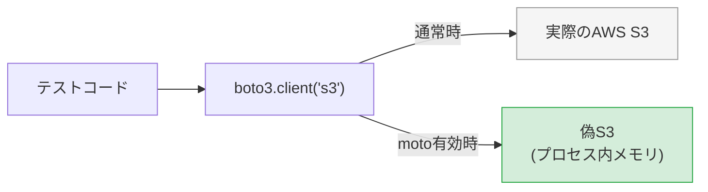
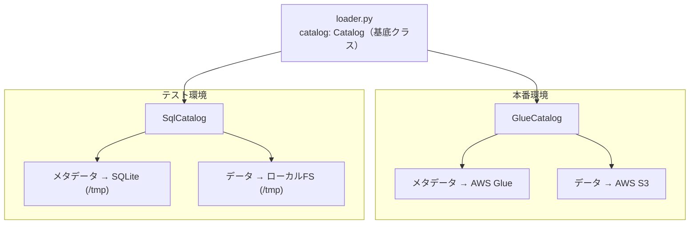
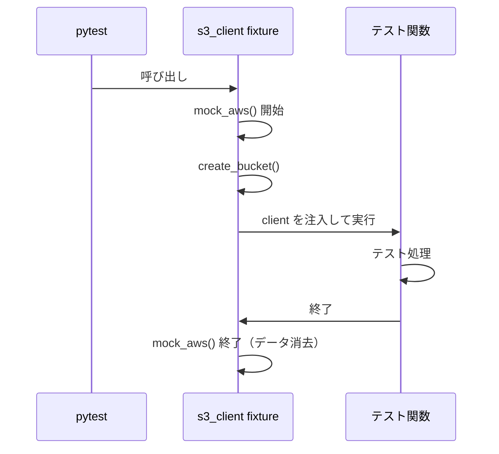

# テストコード解説

このドキュメントでは `lambda/tsv_to_iceberg_load` のテストコードの仕組みを説明する。

> **VS Code でのMermaid表示**：図を表示するには拡張機能 [Markdown Preview Mermaid Support](https://marketplace.visualstudio.com/items?itemName=bierner.markdown-mermaid) が必要。

---

## 目次

1. [テスト方針](#1-テスト方針)
2. [使用ライブラリ](#2-使用ライブラリ)
3. [ディレクトリ構成](#3-ディレクトリ構成)
4. [AWSサービスのモック化](#4-awsサービスのモック化)
5. [fixture（テスト用前提条件）の仕組み](#5-fixtureテスト用前提条件の仕組み)
6. [テストケース一覧と解説](#6-テストケース一覧と解説)
7. [テストの実行方法](#7-テストの実行方法)

---

## 1. テスト方針

このプロジェクトのテストは以下の方針に従っている。

| 方針 | 内容 |
|------|------|
| **実AWSに接続しない** | S3・Glue Data Catalogへの接続はすべてモック（偽物）で代替する |
| **単体テスト・統合テストを分ける** | 関数単位のテストと、S3→Iceberg全体フローのテストを分けて書く |
| **正常系・異常系の両方を書く** | 正しく動くことと、エラー時に正しく失敗することを両方検証する |
| **テストは独立している** | テスト間でデータを共有せず、毎回クリーンな状態から始める |

---

## 2. 使用ライブラリ

### pytest

Pythonの標準的なテストフレームワーク。`test_` で始まる関数を自動検出して実行する。

```python
# 関数名が test_ で始まっていれば pytest が自動的に実行する
def test_something():
    assert 1 + 1 == 2
```

### moto

AWSサービスをプロセス内でエミュレートするライブラリ。実際のAWSに繋がずに、S3・Glueなどのboto3呼び出しを横取りして偽の動作をさせる。



### PyIceberg SqlCatalog

PyIcebergが提供するローカルカタログ実装。SQLite（ファイルDB）をメタデータストアとして使い、ファイルシステムをストレージとして使う。本番で使う `GlueCatalog` と同じインターフェースを持つため、テスト用の差し替えとして機能する。



---

## 3. ディレクトリ構成

```
tsv_to_iceberg_load/
├── src/
│   └── loader.py        ← テスト対象のコード
├── tests/
│   ├── conftest.py      ← fixture定義（テストの前準備をまとめる場所）
│   └── test_loader.py   ← テスト関数の定義
└── pytest.ini           ← pytestの設定（テスト対象ディレクトリ等）
```

**pytest.ini の役割**

```ini
[pytest]
testpaths = tests    # tests/ ディレクトリを自動検索
pythonpath = .       # import src.loader が解決できるようにプロジェクトルートをパスに追加
```

---

## 4. AWSサービスのモック化

### S3のモック（moto）

motoの `mock_aws` をコンテキストマネージャとして使うことで、`with` ブロック内のすべてのboto3呼び出しがモックに向く。

```python
from moto import mock_aws

with mock_aws():
    client = boto3.client("s3", region_name="ap-northeast-1")
    # この client への操作はすべてメモリ上の偽S3に対して行われる
    client.create_bucket(...)   # 実際のAWSには何も起きない
    client.put_object(...)      # 同上
```

モックの特性：
- テストが終わると（`with` ブロックを抜けると）モックのデータはすべて消える
- AWSの認証情報は不要（ダミーが自動設定される）
- boto3のAPIは実物と同じように使える

### Glue Data Catalogのモック（PyIceberg SqlCatalog）

`GlueCatalog` を `SqlCatalog` に差し替えることでモック化する。
これが成立する理由は、両クラスが `pyiceberg.catalog.Catalog` という共通の基底クラスを持ち、`load_table` / `append` / `overwrite` などのメソッドが同じインターフェースで定義されているため。

```python
# 本番コード（handler.py）
from pyiceberg.catalog.glue import GlueCatalog
catalog = GlueCatalog("my_catalog", region_name="ap-northeast-1")

# テストコード（conftest.py）
from pyiceberg.catalog.sql import SqlCatalog
catalog = SqlCatalog("local", uri="sqlite:///...", warehouse="file:///...")

# loader.py は Catalog 基底クラスの型で受け取るため、どちらでも動く
def load_to_iceberg(catalog: Catalog, ...):  # GlueCatalog も SqlCatalog も受け付ける
    table = catalog.load_table(...)
    table.overwrite(arrow_table)
```

SqlCatalogのデータ保存先は `tmp_path`（後述）を使うため、テストごとに自動クリーンアップされる。

---

## 5. fixture（テスト用前提条件）の仕組み

### fixtureとは

テスト関数が必要とする「前提条件（セットアップ）」を定義する仕組み。テスト関数の引数名と一致するfixtureが自動的に呼び出される。

```python
# conftest.py に fixture を定義
@pytest.fixture
def s3_client():
    ...
    yield client   # ← この値がテスト関数の引数に渡される

# テスト関数の引数名 s3_client と一致 → 自動注入される
def test_something(s3_client):
    s3_client.put_object(...)  # すでにバケットが作成済みの状態で使える
```

### conftest.py のfixture解説

#### `s3_client` fixture

```python
@pytest.fixture
def s3_client():
    with mock_aws():                          # motoのモックを有効化
        client = boto3.client("s3", ...)
        client.create_bucket(Bucket=TEST_BUCKET, ...)  # テスト用バケットを作成
        yield client                          # テスト関数に渡す
    # with ブロックを抜けるとモックが無効化（データも消える）
```

テスト関数が呼ばれるたびに：
1. モックS3を起動
2. 空のバケットを作成
3. テスト関数を実行
4. テスト終了後にモックを破棄（データが残らない）



#### `local_catalog` fixture

```python
@pytest.fixture
def local_catalog(tmp_path):          # tmp_path は pytest 組み込み fixture
    catalog = SqlCatalog(
        "local",
        uri=f"sqlite:///{tmp_path}/iceberg.db",      # SQLiteのDBファイル
        warehouse=f"file://{tmp_path}/warehouse",    # Parquetファイルの保存先
    )
    catalog.create_namespace("bronze")               # ネームスペース作成
    catalog.create_table(                            # テーブル作成（スキーマ定義）
        identifier="bronze.test_table",
        schema=TEST_SCHEMA,
    )
    yield catalog
```

`tmp_path` はpytestが提供する組み込みfixtureで、テストごとに異なる一時ディレクトリ（例: `/tmp/pytest-xxx/test_xxx/`）を提供する。テスト終了後に自動で削除されるため、テスト間でIcebergのデータが干渉しない。

#### fixtureの組み合わせ

複数のfixtureを組み合わせて使うことができる。

```python
# s3_client と local_catalog と tmp_path を同時に使う例
def test_load_tsv_to_iceberg_success(s3_client, local_catalog, tmp_path):
    # s3_client    → モックS3（バケット作成済み）
    # local_catalog → ローカルIceberg（テーブル作成済み）
    # tmp_path     → テスト用一時ディレクトリ
    ...
```

---

## 6. テストケース一覧と解説

### 単体テスト：`read_tsv_with_duckdb`

DuckDBのTSV読み込み機能のみを検証する。S3やIcebergは使わない。

| テスト名 | 検証内容 | 使うfixture |
|---------|---------|------------|
| `test_read_tsv_with_duckdb_returns_arrow_table` | TSVを読んでPyArrow Tableが返ること、行数・カラム名が正しいこと | `tmp_path` |
| `test_read_tsv_with_duckdb_empty_file_returns_empty_table` | ヘッダーのみのTSVは0件のTableになること | `tmp_path` |

```python
def test_read_tsv_with_duckdb_returns_arrow_table(tmp_path):
    # 準備：ローカルにTSVファイルを作成
    tsv = tmp_path / "input.tsv"
    tsv.write_text("id\tname\tvalue\n1\talice\t100\n2\tbob\t200\n")

    # 実行
    result = read_tsv_with_duckdb(str(tsv))

    # 検証
    assert isinstance(result, pa.Table)  # PyArrow Tableであること
    assert result.num_rows == 2          # 2行あること
    assert result.column_names == ["id", "name", "value"]  # カラム名が正しいこと
```

### 単体テスト：`download_from_s3`

S3からのダウンロード機能のみを検証する。

| テスト名 | 検証内容 | 使うfixture |
|---------|---------|------------|
| `test_download_from_s3_downloads_file` | ファイルが正しくローカルに保存されること | `s3_client`, `tmp_path` |
| `test_download_from_s3_raises_when_key_not_found` | 存在しないキーは例外になること | `s3_client`, `tmp_path` |

```python
def test_download_from_s3_raises_when_key_not_found(s3_client, tmp_path):
    # pytest.raises で「この処理は例外を投げるはず」と宣言する
    with pytest.raises(ClientError):
        download_from_s3(s3_client, TEST_BUCKET, "not/exist.tsv", str(tmp_path / "x.tsv"))
    # ClientError が投げられなかった場合、このテストは失敗する
```

### 単体テスト：`load_to_iceberg`

Icebergへの書き込み機能のみを検証する。S3は使わない。

| テスト名 | 検証内容 | 使うfixture |
|---------|---------|------------|
| `test_load_to_iceberg_appends_data` | データがIcebergテーブルに書き込まれること | `local_catalog` |
| `test_load_to_iceberg_overwrites_existing_data` | 2回実行してもデータが重複しないこと（洗い替えの検証） | `local_catalog` |
| `test_load_to_iceberg_raises_when_table_not_found` | 存在しないテーブルは例外になること | `local_catalog` |

洗い替えの検証が特に重要なテスト：

```python
def test_load_to_iceberg_overwrites_existing_data(local_catalog):
    first  = pa.table({"id": [1, 2], "name": ["alice", "bob"],  "value": ["100", "200"]})
    second = pa.table({"id": [3],    "name": ["carol"],          "value": ["300"]})

    load_to_iceberg(local_catalog, TEST_NAMESPACE, TEST_TABLE, first)   # 1回目：2件
    load_to_iceberg(local_catalog, TEST_NAMESPACE, TEST_TABLE, second)  # 2回目：1件で上書き

    result = local_catalog.load_table(f"{TEST_NAMESPACE}.{TEST_TABLE}").scan().to_arrow()
    assert result.num_rows == 1        # 2+1=3件ではなく、1件だけであること
    assert result["id"][0].as_py() == 3  # 内容が2回目のデータであること
```

### 統合テスト：`load_tsv_to_iceberg`

S3からIcebergまでの全フローをまとめて検証する。

| テスト名 | 検証内容 | 使うfixture |
|---------|---------|------------|
| `test_load_tsv_to_iceberg_success` | 正常に全フローが完了すること | `s3_client`, `local_catalog`, `tmp_path` |
| `test_load_tsv_to_iceberg_idempotent` | 同じファイルを2回実行しても重複しないこと | `s3_client`, `local_catalog`, `tmp_path` |
| `test_load_tsv_to_iceberg_skips_empty_file` | 0件のTSVはIceberg書き込みをスキップすること | `s3_client`, `local_catalog`, `tmp_path` |
| `test_load_tsv_to_iceberg_raises_when_s3_key_not_found` | S3ファイル未存在で例外になること | `s3_client`, `local_catalog`, `tmp_path` |
| `test_load_tsv_to_iceberg_cleans_up_tmp_file` | 処理後に一時ファイルが削除されること | `s3_client`, `local_catalog`, `tmp_path` |

---

## 7. テストの実行方法

### 全テスト実行

```bash
cd lambda/tsv_to_iceberg_load
pytest
```

### 詳細ログ付きで実行

```bash
pytest -v
```

実行例：
```
tests/test_loader.py::test_read_tsv_with_duckdb_returns_arrow_table PASSED
tests/test_loader.py::test_read_tsv_with_duckdb_empty_file_returns_empty_table PASSED
tests/test_loader.py::test_download_from_s3_downloads_file PASSED
...
9 passed in 3.21s
```

### 特定のテストのみ実行

```bash
# ファイル指定
pytest tests/test_loader.py

# 関数名で絞り込み（部分一致）
pytest -k "s3"
pytest -k "iceberg"
```

### テスト失敗時の出力例

```
FAILED tests/test_loader.py::test_load_to_iceberg_overwrites_existing_data
AssertionError: assert 3 == 1
```

`assert 3 == 1` → 期待値は1件だったが実際には3件あった、つまり洗い替えが機能していないことがわかる。
