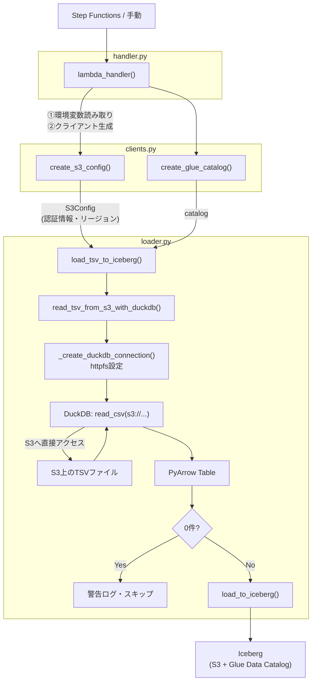

# ソースコード解説

このドキュメントでは `lambda/tsv_to_iceberg_load_2/src/` のソースコードの構造と各ファイルの役割を説明する。

`tsv_to_iceberg_load`（boto3ダウンロード方式）との差異を中心に解説する。

> **VS Code でのMermaid表示**：図を表示するには拡張機能 [Markdown Preview Mermaid Support](https://marketplace.visualstudio.com/items?itemName=bierner.markdown-mermaid) が必要。

---

## 目次

1. [元実装との方式の違い](#1-元実装との方式の違い)
2. [clients.py — AWSクライアント生成](#2-clientspy--awsクライアント生成)
3. [handler.py — Lambdaエントリーポイント](#3-handlerpy--lambdaエントリーポイント)
4. [loader.py — ビジネスロジック](#4-loaderpy--ビジネスロジック)
5. [データフロー全体像](#5-データフロー全体像)
6. [元実装との比較まとめ](#6-元実装との比較まとめ)

---

## 1. 元実装との方式の違い

`tsv_to_iceberg_load`（元実装）は S3 からファイルを `/tmp` にダウンロードしてから DuckDB で読み込む。

本実装（`tsv_to_iceberg_load_2`）は DuckDB の **httpfs 拡張** を使い、S3 上のファイルを直接読み込む。

```
【元実装】 S3 → /tmp（disk write）→ DuckDB → PyArrow → Iceberg
【本実装】 S3 → DuckDB（httpfs） → PyArrow → Iceberg
```

ダウンロードとローカル読み込みのステップが統合され、`/tmp` への書き込み・削除が不要になる。

---

## 2. clients.py — AWSクライアント生成

```python
import boto3
from pyiceberg.catalog.glue import GlueCatalog

from src.loader import S3Config


def create_s3_config(region: str) -> S3Config:
    """Lambda実行ロールの認証情報からS3Configを生成する。"""
    session = boto3.Session()
    credentials = session.get_credentials().resolve()
    return S3Config(
        region=region,
        access_key_id=credentials.access_key,
        secret_access_key=credentials.secret_key,
        session_token=credentials.token,
    )


def create_glue_catalog(name: str, region: str) -> GlueCatalog:
    return GlueCatalog(name, **{"region_name": region})
```

### 元実装との差異

元実装の `create_s3_client()` は `boto3.client("s3")` を返すだけだった。
本実装では `create_s3_config()` が `S3Config` dataclass を返す。

DuckDB の httpfs はboto3を経由しないため、認証情報を明示的に渡す必要がある。
`boto3.Session().get_credentials().resolve()` で Lambda 実行ロールの IAM 認証情報を取得し、`S3Config` に詰めて DuckDB に渡す。

| 取得する情報 | `S3Config` フィールド |
|------------|----------------------|
| アクセスキーID | `access_key_id` |
| シークレットアクセスキー | `secret_access_key` |
| セッショントークン（一時認証の場合） | `session_token` |

`.resolve()` を呼ぶ理由は、環境変数・IAMロール・プロファイルなど複数の認証情報ソースを解決し、実際の値を確定させるため。

---

## 3. handler.py — Lambdaエントリーポイント

```python
def lambda_handler(event: dict, context) -> dict:
    region   = os.environ["GLUE_REGION"]
    database = os.environ["GLUE_DATABASE"]
    table    = os.environ["GLUE_TABLE"]

    bucket: str = event["s3_bucket"]
    key: str    = event["s3_key"]

    s3_config = create_s3_config(region=region)
    catalog   = create_glue_catalog(name=database, region=region)

    load_tsv_to_iceberg(
        s3_config=s3_config,
        catalog=catalog,
        namespace=database,
        table_name=table,
        bucket=bucket,
        key=key,
    )

    return {"statusCode": 200, "body": "OK"}
```

### 元実装との差異

`create_s3_client()` の代わりに `create_s3_config()` を呼ぶ点のみ異なる。
`load_tsv_to_iceberg` に渡す引数が `s3_client` から `s3_config` に変わっている。
役割と構造は元実装と同一。

---

## 4. loader.py — ビジネスロジック

### S3Config dataclass

```python
@dataclass
class S3Config:
    region: str
    access_key_id: str
    secret_access_key: str
    session_token: str | None = None
    # テスト時にmotoサーバーのエンドポイントを指定するためのフィールド
    # 本番環境では None のまま使用する
    endpoint: str | None = None
    use_ssl: bool = True
    url_style: str = "vhost"
```

DuckDB の httpfs に渡す S3 接続設定をまとめた dataclass。
`endpoint` と `use_ssl` と `url_style` はテスト用フィールドで、本番では `None` / `True` / `"vhost"` のデフォルト値のまま使う。
テスト時に moto サーバーを指定できるよう設計している（詳細はテストコード解説を参照）。

---

### _create_duckdb_connection

```python
def _create_duckdb_connection(s3_config: S3Config) -> duckdb.DuckDBPyConnection:
    conn = duckdb.connect(":memory:")
    conn.execute("SET home_directory='/tmp'")
    conn.execute("INSTALL httpfs")
    conn.execute("LOAD httpfs")
    conn.execute(f"SET s3_region='{s3_config.region}'")
    conn.execute(f"SET s3_access_key_id='{s3_config.access_key_id}'")
    conn.execute(f"SET s3_secret_access_key='{s3_config.secret_access_key}'")
    if s3_config.session_token:
        conn.execute(f"SET s3_session_token='{s3_config.session_token}'")
    if s3_config.endpoint:
        conn.execute(f"SET s3_endpoint='{s3_config.endpoint}'")
    conn.execute(f"SET s3_use_ssl={'true' if s3_config.use_ssl else 'false'}")
    conn.execute(f"SET s3_url_style='{s3_config.url_style}'")
    return conn
```

httpfs 拡張をセットアップした DuckDB 接続を生成する。

#### SET home_directory='/tmp' が必要な理由

Lambda のファイルシステムは `/tmp` 以外読み取り専用になっている。
`INSTALL httpfs` は拡張ファイルを `home_directory` 配下に書き込むため、書き込み可能な `/tmp` を指定する必要がある。

| 設定 | 内容 |
|------|------|
| `INSTALL httpfs` | httpfs 拡張を `/tmp` にインストール（初回のみダウンロード） |
| `LOAD httpfs` | インストール済みの拡張をロードして有効化 |
| `SET s3_*` | S3 接続に必要な認証情報・リージョン・エンドポイントを設定 |

---

### read_tsv_from_s3_with_duckdb

```python
def read_tsv_from_s3_with_duckdb(s3_config: S3Config, bucket: str, key: str) -> pa.Table:
    conn = _create_duckdb_connection(s3_config)
    s3_path = f"s3://{bucket}/{key}"
    logger.info(f"Reading {s3_path} via DuckDB httpfs")
    query = f"SELECT * FROM read_csv('{s3_path}', delim='\t', header=true)"
    return conn.execute(query).fetch_arrow_table()
```

元実装の `download_from_s3` + `read_tsv_with_duckdb` の2関数を1関数に統合したもの。
`read_csv` に `s3://` パスを渡すだけで DuckDB が S3 へ直接アクセスして読み込む。

---

### load_to_iceberg・load_tsv_to_iceberg

元実装と同一の構造。`load_to_iceberg` はコードが完全に同一。
`load_tsv_to_iceberg` は `s3_client` / `tmp_dir` の引数がなくなり、`s3_config` のみになった点が異なる。

```python
# 元実装
def load_tsv_to_iceberg(s3_client, catalog, namespace, table_name, bucket, key, tmp_dir="/tmp")

# 本実装
def load_tsv_to_iceberg(s3_config: S3Config, catalog, namespace, table_name, bucket, key)
```

また、`/tmp` ファイルの後処理（`finally: os.remove`）が不要になるため、`try/finally` ブロックがなくなっている。

---

## 5. データフロー全体像



元実装にあった `/tmp` への書き込み・削除ステップが存在しない。

---

## 6. 元実装との比較まとめ

| 観点 | 元実装（boto3ダウンロード） | 本実装（httpfs直接読み込み） |
|------|--------------------------|---------------------------|
| S3アクセス手段 | `boto3.client("s3")` | DuckDB httpfs拡張 |
| 認証情報の渡し方 | boto3が自動取得 | `S3Config` に明示的に設定 |
| `/tmp` 使用 | ファイルの一時保存に使用 | httpfs拡張のインストールのみ |
| ファイルの後処理 | `os.remove` が必要 | 不要 |
| 関数の構成 | `download_from_s3` + `read_tsv_with_duckdb` | `read_tsv_from_s3_with_duckdb` に統合 |
| テスト方式 | `@mock_aws` デコレータ | `ThreadedMotoServer` |
