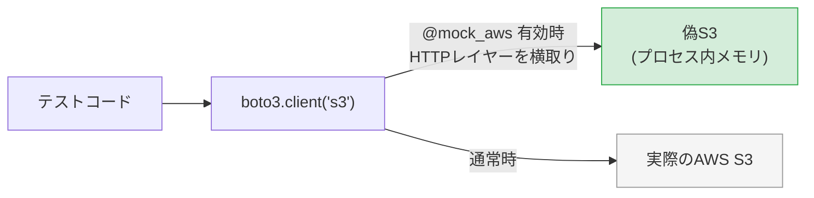
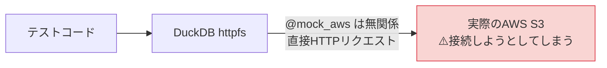
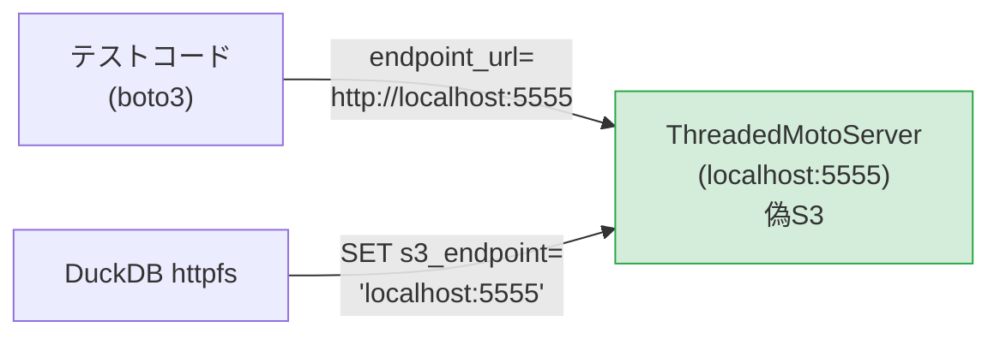
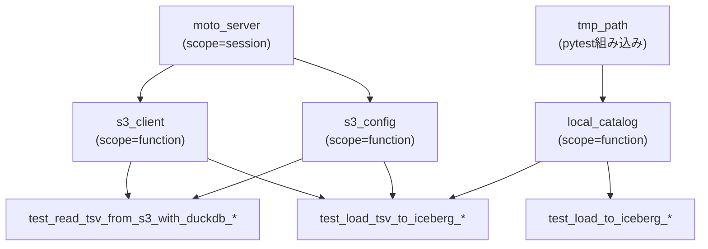

# テストコード解説

このドキュメントでは `lambda/tsv_to_iceberg_load_2` のテストコードの仕組みを説明する。

元実装（`tsv_to_iceberg_load`）との最大の違いは **S3 のモック方法** にある。
元実装との差異を中心に解説する。

> **VS Code でのMermaid表示**：図を表示するには拡張機能 [Markdown Preview Mermaid Support](https://marketplace.visualstudio.com/items?itemName=bierner.markdown-mermaid) が必要。

---

## 目次

1. [テスト方針](#1-テスト方針)
2. [なぜ @mock_aws が使えないか](#2-なぜ-mock_aws-が使えないか)
3. [解決策：motoサーバーモード](#3-解決策motoサーバーモード)
4. [fixture（テスト用前提条件）の仕組み](#4-fixtureテスト用前提条件の仕組み)
5. [テストケース一覧と解説](#5-テストケース一覧と解説)
6. [テストの実行方法](#6-テストの実行方法)

---

## 1. テスト方針

元実装と同じ方針を継承する。

| 方針 | 内容 |
|------|------|
| **実AWSに接続しない** | S3・Glue Data Catalogへの接続はすべてモックで代替する |
| **単体テスト・統合テストを分ける** | 関数単位のテストと、S3→Iceberg全体フローのテストを分けて書く |
| **正常系・異常系の両方を書く** | 正しく動くことと、エラー時に正しく失敗することを両方検証する |
| **テストは独立している** | テスト間でデータを共有せず、毎回クリーンな状態から始める |

---

## 2. なぜ @mock_aws が使えないか

元実装では moto の `@mock_aws` デコレータで S3 をモックできた。
本実装では使えない。

### @mock_aws の動作原理

`@mock_aws` は boto3 の HTTP レイヤーに割り込み、S3 への HTTP リクエストをプロセス内のメモリ上の偽 S3 にリダイレクトする。



### DuckDB httpfs は boto3 を経由しない

DuckDB の httpfs 拡張は **独自の HTTP クライアント** で S3 へ直接リクエストを送る。
boto3 のレイヤーを通らないため、`@mock_aws` のフックが一切効かない。



`@mock_aws` を使っても DuckDB からの S3 アクセスはモックされず、実際の AWS に繋ぎに行こうとする。

---

## 3. 解決策：motoサーバーモード

moto は HTTP サーバーとして単独で起動する **サーバーモード** を持つ。
`ThreadedMotoServer` を使うと実際の HTTP サーバーが起動し、任意の HTTP クライアントがそこへアクセスできる。

DuckDB の httpfs に moto サーバーのアドレスを S3 エンドポイントとして設定することで、DuckDB からのリクエストもモックできる。



boto3 と DuckDB の両方が同じ moto サーバーに向くため、boto3 で `put_object` したファイルを DuckDB の `read_csv` で読み込める。

### path-style URL の指定が必要な理由

通常の S3 は `bucket.s3.amazonaws.com/key` のような **vhost-style** URL を使う。
moto サーバーはドメインベースのルーティングを持たないため、`localhost:5555/bucket/key` の **path-style** URL のみ対応する。

DuckDB 側で `SET s3_url_style='path'` を指定しないと、DuckDB は `bucket.localhost:5555/key` という存在しないアドレスにアクセスしようとしてしまう。

---

## 4. fixture（テスト用前提条件）の仕組み

### conftest.py の全体構造

```python
# scope="session"：テストセッション全体で1回だけ起動・停止
@pytest.fixture(scope="session")
def moto_server(): ...

# scope デフォルト（function）：テストごとにバケット作成・削除
@pytest.fixture
def s3_client(moto_server): ...

# scope デフォルト（function）：DuckDB用のS3設定
@pytest.fixture
def s3_config(moto_server): ...

# scope デフォルト（function）：ローカルIceberg
@pytest.fixture
def local_catalog(tmp_path): ...
```

---

#### `moto_server` fixture

```python
@pytest.fixture(scope="session")
def moto_server():
    server = ThreadedMotoServer(port=MOTO_PORT)
    server.start()
    yield f"localhost:{MOTO_PORT}"
    server.stop()
```

moto を HTTP サーバーとして起動し、アドレス文字列（`"localhost:5555"`）を yield する。

`scope="session"` にしている理由：サーバーの起動・停止はコストが高いため、テストセッション全体で1回だけ行う。テストごとにサーバーを再起動する必要はない。

```mermaid
sequenceDiagram
    participant session as テストセッション開始
    participant server as ThreadedMotoServer
    participant t1 as テスト1
    participant t2 as テスト2
    participant end as テストセッション終了

    session->>server: server.start()
    server->>t1: "localhost:5555" を渡す
    t1->>t1: テスト実行
    server->>t2: "localhost:5555" を渡す
    t2->>t2: テスト実行
    end->>server: server.stop()
```

---

#### `s3_client` fixture

```python
@pytest.fixture
def s3_client(moto_server):
    client = boto3.client(
        "s3",
        endpoint_url=f"http://{moto_server}",
        region_name="ap-northeast-1",
        aws_access_key_id="test",
        aws_secret_access_key="test",
    )
    client.create_bucket(
        Bucket=TEST_BUCKET,
        CreateBucketConfiguration={"LocationConstraint": "ap-northeast-1"},
    )
    yield client
    # テスト後にバケット内オブジェクトとバケットを削除
    objects = client.list_objects_v2(Bucket=TEST_BUCKET).get("Contents", [])
    for obj in objects:
        client.delete_object(Bucket=TEST_BUCKET, Key=obj["Key"])
    client.delete_bucket(Bucket=TEST_BUCKET)
```

moto サーバーに接続する boto3 クライアントを生成し、テスト用バケットを作成する。

#### 元実装との差異

| 観点 | 元実装 | 本実装 |
|------|--------|--------|
| モック方法 | `with mock_aws():` | `endpoint_url` で moto サーバーへ向ける |
| クリーンアップ | `with` ブロック終了時に自動消去 | yield 後に明示的にバケット削除が必要 |
| 認証情報 | ダミーが自動設定される | `aws_access_key_id="test"` を明示的に指定 |

元実装では moto のコンテキストマネージャがモックデータを自動で破棄していた。
本実装では moto サーバーはセッション全体で生きているため、テスト後に明示的にバケットを削除しないと次のテストに影響する。

---

#### `s3_config` fixture

```python
@pytest.fixture
def s3_config(moto_server):
    return S3Config(
        region="ap-northeast-1",
        access_key_id="test",
        secret_access_key="test",
        endpoint=moto_server,
        use_ssl=False,
        url_style="path",
    )
```

DuckDB の httpfs を moto サーバーへ向けるための設定。

| フィールド | 値 | 理由 |
|-----------|-----|------|
| `endpoint` | `"localhost:5555"` | DuckDB の S3 アクセス先を moto サーバーに向ける |
| `use_ssl` | `False` | moto サーバーはHTTPのみ対応（SSLなし） |
| `url_style` | `"path"` | moto サーバーはvhost-style URLに対応していない |

本番環境（`handler.py`）では `clients.py` の `create_s3_config()` がこれらのフィールドをデフォルト値（`endpoint=None`, `use_ssl=True`, `url_style="vhost"`）のままにするため、実際の S3 へ通常どおりアクセスする。

---

#### `local_catalog` fixture

元実装と同一。PyIceberg の `SqlCatalog` を使ってローカル環境でカタログをエミュレートする。

```python
@pytest.fixture
def local_catalog(tmp_path):
    catalog = SqlCatalog(
        "local",
        uri=f"sqlite:///{tmp_path}/iceberg.db",
        warehouse=f"file://{tmp_path}/warehouse",
    )
    catalog.create_namespace(TEST_NAMESPACE)
    catalog.create_table(identifier=f"{TEST_NAMESPACE}.{TEST_TABLE}", schema=TEST_SCHEMA)
    yield catalog
```

---

#### fixture の依存関係



---

## 5. テストケース一覧と解説

### 単体テスト：`read_tsv_from_s3_with_duckdb`

元実装の `download_from_s3` + `read_tsv_with_duckdb` に対応するテスト。
S3 へのアクセスが含まれるため `s3_client` と `s3_config` の両方が必要になる。

| テスト名 | 検証内容 | 使うfixture |
|---------|---------|------------|
| `test_read_tsv_from_s3_with_duckdb_returns_arrow_table` | S3上のTSVをhttpfsで読んでPyArrow Tableが返ること、行数・カラム名が正しいこと | `s3_client`, `s3_config` |
| `test_read_tsv_from_s3_with_duckdb_empty_file_returns_empty_table` | ヘッダーのみのTSVは0件のTableになること | `s3_client`, `s3_config` |
| `test_read_tsv_from_s3_with_duckdb_raises_when_key_not_found` | 存在しないキーは例外になること | `s3_client`, `s3_config` |

```python
def test_read_tsv_from_s3_with_duckdb_returns_arrow_table(s3_client, s3_config):
    # 準備：boto3でmotoサーバーにファイルをアップロード
    s3_client.put_object(
        Bucket=TEST_BUCKET,
        Key="data/input.tsv",
        Body="id\tname\tvalue\n1\talice\t100\n2\tbob\t200\n".encode(),
    )

    # 実行：DuckDB httpfsでmotoサーバーからファイルを読み込む
    result = read_tsv_from_s3_with_duckdb(s3_config, TEST_BUCKET, "data/input.tsv")

    # 検証
    assert isinstance(result, pa.Table)
    assert result.num_rows == 2
    assert result.column_names == ["id", "name", "value"]
```

boto3 で put したファイルを DuckDB が読めることで、両者が同じ moto サーバーを参照していることも暗に検証できる。

---

### 単体テスト：`load_to_iceberg`

元実装と同一のテスト。`load_to_iceberg` 関数のコード自体も同一のため、内容も変わらない。

| テスト名 | 検証内容 | 使うfixture |
|---------|---------|------------|
| `test_load_to_iceberg_appends_data` | データがIcebergテーブルに書き込まれること | `local_catalog` |
| `test_load_to_iceberg_overwrites_existing_data` | 2回実行してもデータが重複しないこと（洗い替えの検証） | `local_catalog` |
| `test_load_to_iceberg_raises_when_table_not_found` | 存在しないテーブルは例外になること | `local_catalog` |

---

### 統合テスト：`load_tsv_to_iceberg`

元実装と同等のケースを網羅する。`tmp_path` が引数から消えている点が異なる。

| テスト名 | 検証内容 | 元実装との差異 |
|---------|---------|--------------|
| `test_load_tsv_to_iceberg_success` | 正常に全フローが完了すること | `tmp_path` 引数が不要 |
| `test_load_tsv_to_iceberg_idempotent` | 同じファイルを2回実行しても重複しないこと | 同上 |
| `test_load_tsv_to_iceberg_skips_empty_file` | 0件のTSVはIceberg書き込みをスキップすること | 同上 |
| `test_load_tsv_to_iceberg_raises_when_s3_key_not_found` | S3ファイル未存在で例外になること | 同上 |

元実装にあった `test_load_tsv_to_iceberg_cleans_up_tmp_file`（一時ファイル削除の検証）は、httpfs方式では `/tmp` へのファイル書き込みが存在しないため不要になる。

---

## 6. テストの実行方法

### 全テスト実行

```bash
cd lambda/tsv_to_iceberg_load_2
pytest
```

### 詳細ログ付きで実行

```bash
pytest -v
```

実行例：
```
tests/test_loader.py::test_read_tsv_from_s3_with_duckdb_returns_arrow_table PASSED
tests/test_loader.py::test_read_tsv_from_s3_with_duckdb_empty_file_returns_empty_table PASSED
tests/test_loader.py::test_read_tsv_from_s3_with_duckdb_raises_when_key_not_found PASSED
tests/test_loader.py::test_load_to_iceberg_appends_data PASSED
...
11 passed in 5.43s
```

### 特定のテストのみ実行

```bash
pytest -k "read_tsv"
pytest -k "iceberg"
```

### 元実装との実行時間の違い

`moto_server` fixture は `scope="session"` のため、初回テスト時にサーバー起動のオーバーヘッドが発生する。
テスト数が少ない場合は元実装（`@mock_aws`）より若干遅くなる可能性がある。
